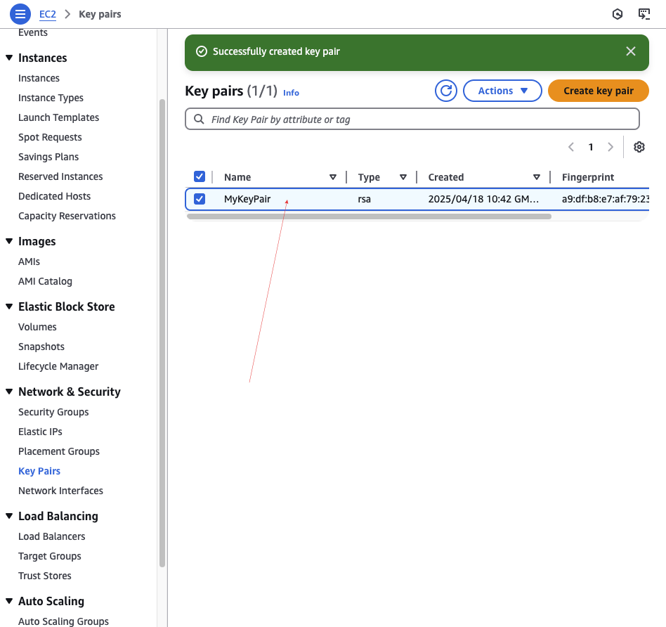
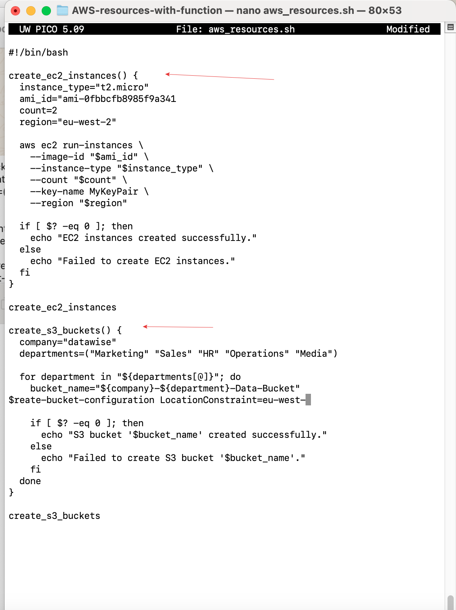
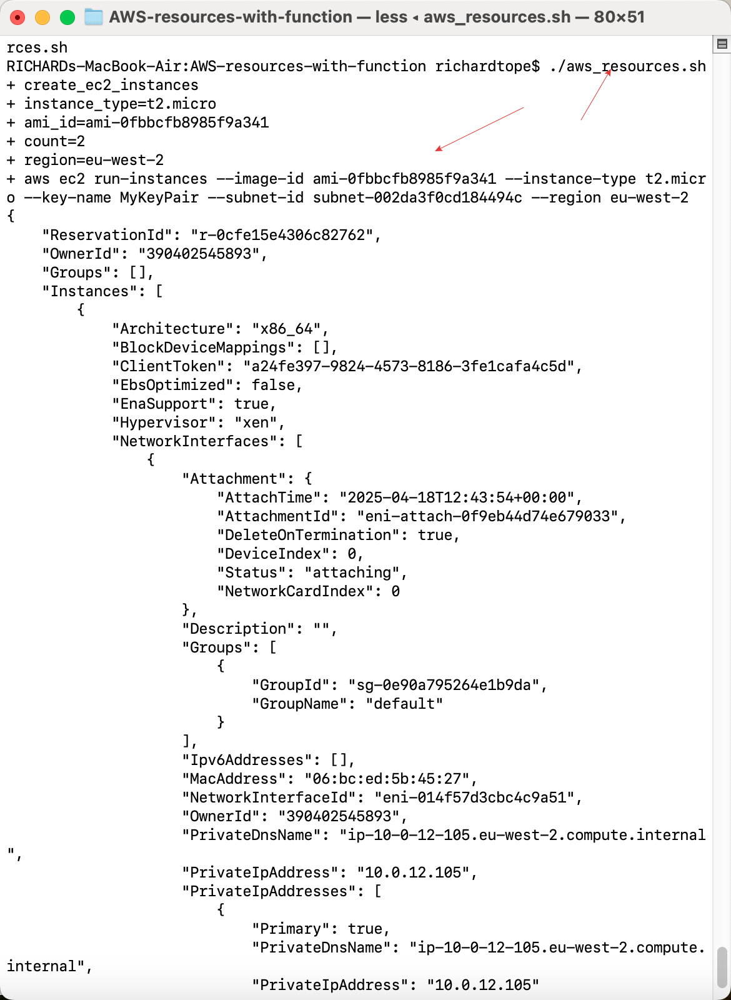
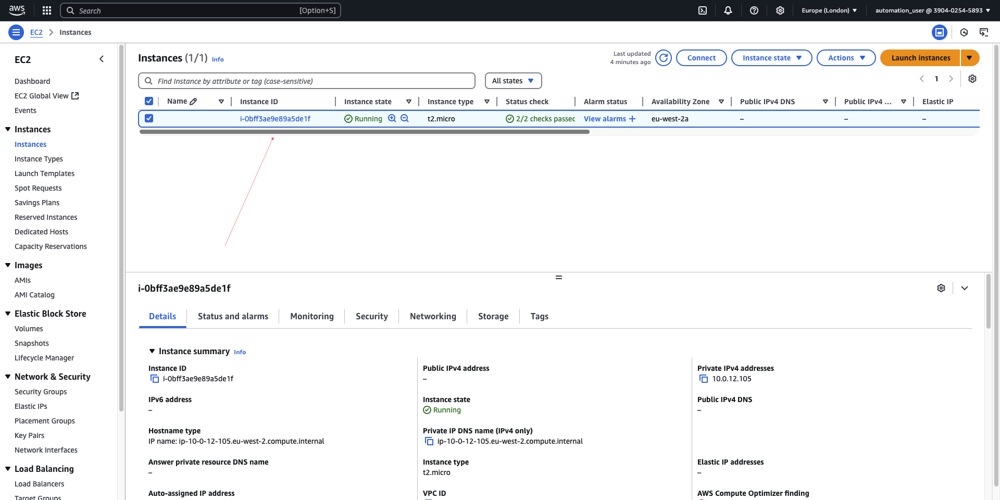

# AWS-resources-with-function

Creating AWS Resources With Functions and Introducing Arrays

## Step 1: Creating a Key Pair

- The first step is to create a key pair that will be used for our CLI operations. Save the key pair to your local machine for secure access.

## Step 2: Creating a Shell Script

- We will create a shell script named `aws_resources.sh`.

- In this script, we will add two main functions: one for EC2 instance creation and another for S3 bucket creation.

- While adding the EC2 and S3 bucket functions, an error was encountered. The issue was resolved by updating the AMI ID and creating a VPC that allows subnets to process the request successfully.

- After resolving the error, grant execution permission to the script using the command:

  `chmod +x aws_resources.sh`

  Execute the script using the command:

  `./aws_resources.sh`
  
- Below is the output of the script execution:

- From the result, the EC2 instance has been created successfully.

- Additionally, the S3 bucket creation process was completed, as shown below:

## Summary
This project focuses on automating the creation of AWS resources using shell scripting while incorporating key programming concepts like functions and arrays. It consists of two main functions:

EC2 Provisioning Function:
This function uses the AWS CLI run-instances command to simulate the creation of EC2 instances with specific parameters such as AMI ID, instance type, instance count, and region. This ensures efficiency and scalability in resource provisioning.

S3 Bucket Setup Function:
This function leverages arrays to loop through a collection of department names, dynamically creating unique bucket names for departments such as Marketing, Sales, HR, Operations, and Media.

Through this simulation, the project provides hands-on experience in resource automation, script debugging, and understanding AWS CLI commands. It offers a cost-free learning approach by running locally, making it an excellent resource for beginners and professionals alike.